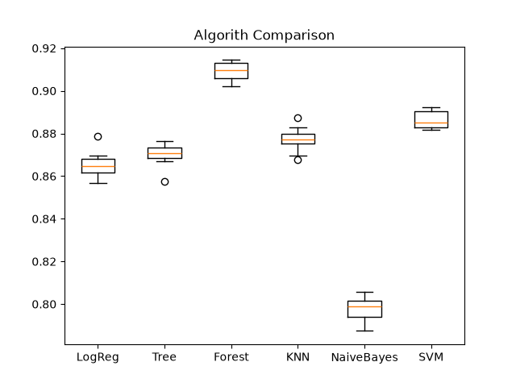

# Credit Risk Predictor

An end-to-end machine learning pipeline that predicts loan defaults using classification models trained on historical banking data.

## Project Overview
This project evaluates applicant financial and demographic metrics—including income, loan amount, applicant age, employment length, loan-to-income ratio, home ownership status, and assigned loan grade—to predict whether an applicant will default on a loan (`loan_status`).

## Methodology & Pipeline
1. **Preprocessing & Encoding:** Categorical features (`person_home_ownership`, `loan_grade`) are converted to binary vectors using One-Hot Encoding (`pd.get_dummies`).
2. **Feature Scaling:** Features are standardized using Scikit-Learn's `StandardScaler` to prevent high-magnitude features (e.g., annual income) from biasing distance-based and linear models.
3. **Cross-Validation Arena:** Evaluates six distinct classification algorithms using 10-fold stratified cross-validation (`StratifiedKFold`).
4. **Inference Pipeline:** A production-style inference pipeline aligns incoming single-record feature schema and applies the learned scaler before generating a live decision.

## Model Evaluation & Selection
Six algorithms were evaluated across 10 stratified folds on the scaled training data:

* **Random Forest Classifier (`Forest`)**: ~90.92% (Top Performer)
* **Support Vector Classifier (`SVM`)**: ~88.63%
* **K-Nearest Neighbors (`KNN`)**: ~87.73%
* **Decision Tree (`Tree`)**: ~87.01%
* **Logistic Regression (`LogReg`)**: ~86.55%
* **Gaussian Naive Bayes (`NaiveBayes`)**: ~79.80%



**Conclusion:** `RandomForestClassifier` demonstrated the highest mean accuracy and lowest variance across cross-validation folds, making it the selected model for the live prediction pipeline.

## Technologies Used
* **Python 3**
* **Pandas** (Data loading, cleaning, manipulation, and one-hot encoding)
* **Scikit-Learn** (Preprocessing, stratified cross-validation, and classification models)
* **Matplotlib** (Cross-validation distribution boxplot generation)

## Dataset
Trained on the Kaggle Credit Risk Dataset. Ensure `bank_data.csv` is present in the root directory before running the script.

## Setup & Execution
1. Clone the repository:
   ```bash
   git clone <your-repo-url>
   cd Credit_Risk_Prediction